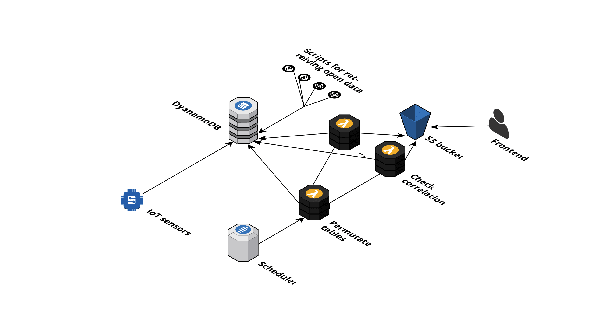

# iot_correlations*
Finding curious correlations between IoT sensors and different open data

["The frontend part you can find on the GitHub pages for that project."](https://vz10.github.io/iot_correlations/)

We've got three different explanation for you about what is this project about so you can choose whichever you want. The first is a normal explanation, the second is epic and the last one is physical.

### Normal explanation
If you haven't seen the book by Tyler Vigen named ["Spurious correlations"](http://www.tylervigen.com/spurious-correlations) you should defenitely have a look. The author explored a big amount of the open data, finding correlations between absolutely unconnected events so it really started looking connected, for example, do you know that Per capita cheese consumption and Number of people who died by becoming tangled in their bedsheets have correlation about 95%.
So inspired but that book we decided to go further and try to find a correlation between real-time data from the different sensors connected to the Arduino (now we have temperature, light and noise sensors) and different open data streams. What we've got you can see on the git page of the project. Charts refreshed twice a day.

### Epic explanation
Have you ever heard about the butterfly effect? (In chaos theory, the butterfly effect is the sensitive dependence on initial conditions in which a small change in one state of a deterministic nonlinear system can result in large differences in a later state.) So we can imagine that one event in the past can start several different chains of events which went in different directions but remain coherent. So we can try to find such pairs of correlative events, for example, the air pressure in the Paris may changes very similar to the index of Dow Jones, and looking at one of the chains we can predict the behavior of another.

### Physical explanation
Have you ever heard about the string theory? In physics, string theory is a theoretical framework in which the point-like particles of particle physics are replaced by one-dimensional objects called strings. So everything in the Universe is strings and everything are waving according to some laws. So if we find to strings which waving very similar in some period of time we can, with a big amount of confident, think that they have similar laws of waving and will wave coherently in the future. So we can try to find such pairs of correlative strings, for example, the air pressure in the Paris may changes very similar to the index of Dow Jones, and looking at the changing of one data flow we can predict the behavior of another.

---

Unfortunately we don't have a lot of connected sensors and not a lot of connected open data streams so there could be only a few correlations found (sometimes there even can be no correlations at all), but we a growing so I hope in nearest future there will be the plenty amount of different curious correlations. So keep in touch :) 

---

## Now let's go to the technical part

We have Arduino with sensors connected to it, we have RaspberryPi connected to the Arduino that getting all the data from the sensors and send it to the AWS IoT. In the AWS IoT we have a bunch of rules which parse the sensors data and store it in the dynamodb tables. Also, we have scripts on the RaspberryPi which take open data from different APIs and also send it to the dynamodb tables.
To find correlation we have a lambda function which fired by cron event from CloudWatch twice a day. This lambda constructs all the permutations of the "sensors" tables and "non-sensor" tables and fire another lambda for each pair. The second lambda function finds a correlation of the data from the tables and if correlation greater then 0.7 it creates JSON file in the S3 bucket with names of the tables and data from them.
The frontend part is the static HTML/JS page which goes to the S3, get all the files from the bucket and creates charts based on these data.

##### Yes you really need numpy here in the folder because it was compiled especially for the AWS AMI which uses in the lambda containers

*everything you'll read is just a funny exploration and can't be considered as a real discovery or something serious
